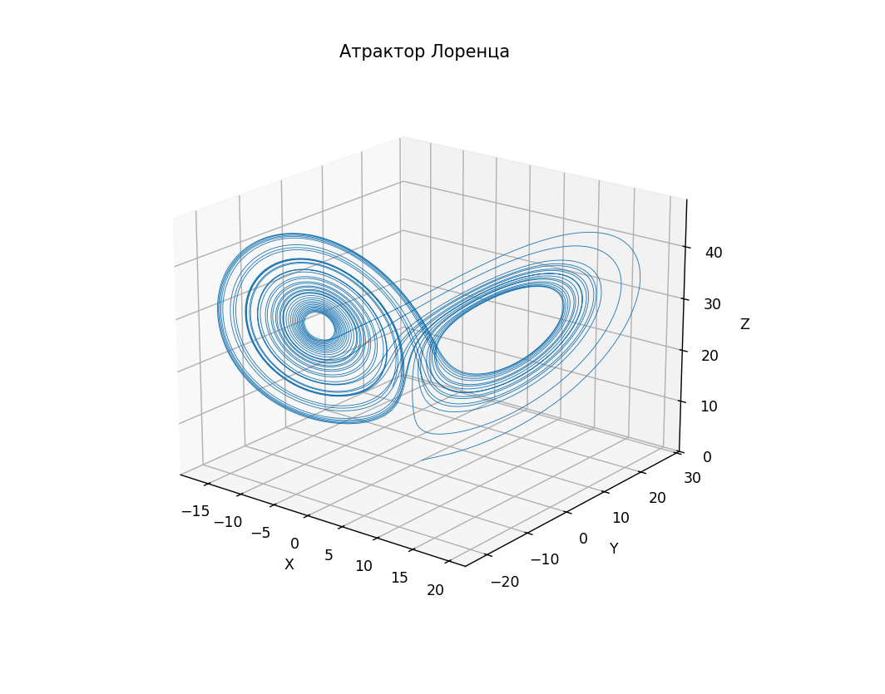
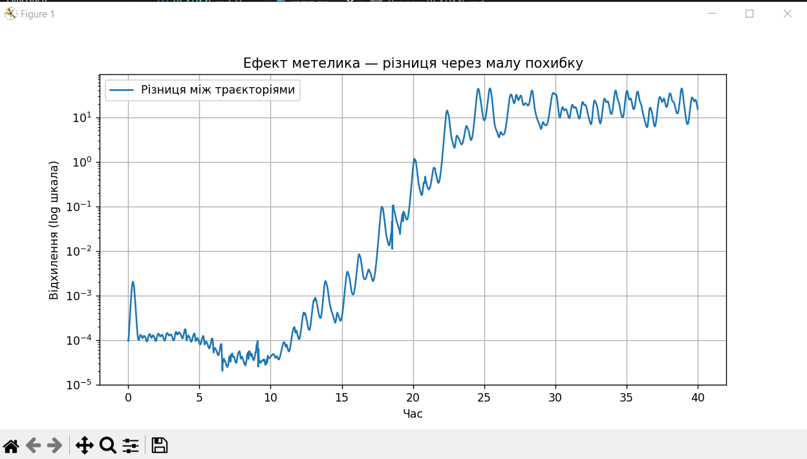
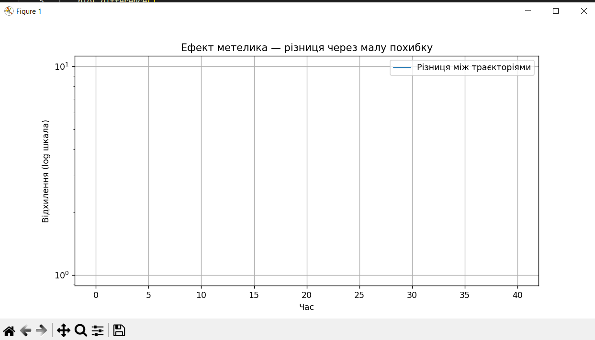

# Атрактор лоренца або Модель хаосу

В цій лабораторній роботі потрібно розібратися, що таке атрактор Лоренца, чому він так називається і до чого тут 'крила метелика'.

## Атрактор лоренца

Ця фігура чудово описує модель хаосу, хоча,
```bash
Варто зазначити, терміни хаос та дивний атрактор не вживалися в оригінальній роботі Лоренца (вони з'явилися в науковій літературі дещо пізніше), натомість йшлося про аперіодичні рухи.
```
Сам Едвард Лоренц [описав](https://www.wikiwand.com/uk/articles/%D0%A2%D0%B5%D0%BE%D1%80%D1%96%D1%8F_%D1%85%D0%B0%D0%BE%D1%81%D1%83#google_vignette) теорію хаосу так:
```bash
Хаос: коли нинішній стан визначає майбутнє, але приблизний нинішній стан не визначає майбутнє навіть приблизно.
```
Для того, щоб відобразити "крила метелика" я використав [готову систему диференційних рівнянь](https://uk.wikipedia.org/wiki/%D0%94%D0%B8%D0%B2%D0%BD%D0%B8%D0%B9_%D0%B0%D1%82%D1%80%D0%B0%D0%BA%D1%82%D0%BE%D1%80_%D0%9B%D0%BE%D1%80%D0%B5%D0%BD%D1%86%D0%B0) на пайтоні:
```python
def lorenz(t, state, sigma=10.0, rho=28.0, beta=8.0 / 3.0):
    x, y, z = state
    dx = sigma * (y - x)
    dy = x * (rho - z) - y
    dz = x * y - beta * z
    return [dx, dy, dz]
```
Потім виводиться малюнок за допомогою ```matplotlib```:
```python
def plot_attractor():
    state = [1.0, 1.0, 1.0]
    _, sol = solve_lorenz(state)

    fig = plt.figure(figsize=(10, 7))
    ax = fig.add_subplot(111, projection="3d")
    ax.plot(sol[0], sol[1], sol[2], lw=0.5)
    ax.set_title("Атрактор Лоренца")
    ax.set_xlabel("X")
    ax.set_ylabel("Y")
    ax.set_zlabel("Z")
    plt.show()
```


## Ефект метелика

Лоренц говорив, що через мінімальну похибку спочатку результат стає непердбачуваним. Для відображення цієї теорії створюю функцію, яка візуалізує "ефект метелика":
```python
def plot_difference():
    state1 = [1.0, 1.0, 1.0]
    state2 = [1.0001, 1.0, 1.0]

    t, sol1 = solve_lorenz(state1)
    _, sol2 = solve_lorenz(state2)
    difference = np.linalg.norm(sol1 - sol2, axis=0)

    plt.figure(figsize=(10, 5))
    plt.plot(t, difference, label="Різниця між траєкторіями")
    plt.yscale("log")
    plt.title("Ефект метелика — різниця через малу похибку")
    plt.xlabel("Час")
    plt.ylabel("Відхилення (log шкала)")
    plt.grid(True)
    plt.legend()
    plt.show()
```
Початкові стани ```state1``` і ```state2``` розв'язують рівняння Лоренца з обох початкових станів, які відрізняються на одну десятитисячну.

Як бачимо, дуже маленьке відхилення у початкових даних з часом експоненційно зростає(у логарифм. масштабі по осі `y`).

Вивід, якби вони мали абсолютно однаковий початковий стан(
```python
state1 = [1.0, 1.0, 1.0]
state2 = [1.0, 1.0, 1.0]
```
):

Ліній різниці немає, як і самої різниці.

## Що таке хаос?

Хаос - поведінка динамічної(постійно змінюється) системи, яка є 'детермінованою'(яка рухається чітко без усіляких непередбачуваних змін), але є чутливою до початкових умов. Своїми словами - це якась система, яка вже не раз дійшла до кінця, але коли і де саме цей кінець невідомо, адже початкова умова трішки відрізняється від попередньої, хоча рух буде не випадковим. Наприклад, метелик змахнув крилами в Бразилії - почався ураган в Техасі.

## Що таке атрактор Лоренца, чому він так називається, що він показує.

[Атрактор Лоренца](https://www.kievoi.ippo.kubg.edu.ua/kievoi/dynsys/lorence.html) це чудовий приклад хаотичної траєкторії який показує чутливість до початкових умов динамічних систем.

Названий в честь Едварда Лоренца, який, намагаючись спростити атмосферну динаміку, розробив цю модель.
```bash
Лоренц міркував так: якщо погода справді належить до настільки чутливих систем, то помах крил чайки може викликати істотні зміни погоди. Згодом чайку замінили на метелика, а в 1972 році з’явилася работа «Передбачуваність: чи може помах крил метелика в Бразилії призвести до торнадо в Техасі?». Так народився знаменитий термін «ефект метелика», що викликає асоціації з науково-фантастичним оповіданням Рея Бредбері та з відкриттям Лоренца – дивним атрактором, названим на його честь.
```

## Що впливає на якість розрахунків в моделі передбачення погоди та як атрактор Лоренца показує проблеми з цим?

Атрактор Лоренца показує, що мінімальне відхилення в початковій умові призводить до непередбачуваних результатів. Звідси, якщо навіть одне значення температури або тиску виміряне з похибкою, то через кілька днів прогноз може бути повністю хибним. Тобто, якийсь вулка на іншому кінці планети може абсолютно змінити довгостроковий прогноз погоди.